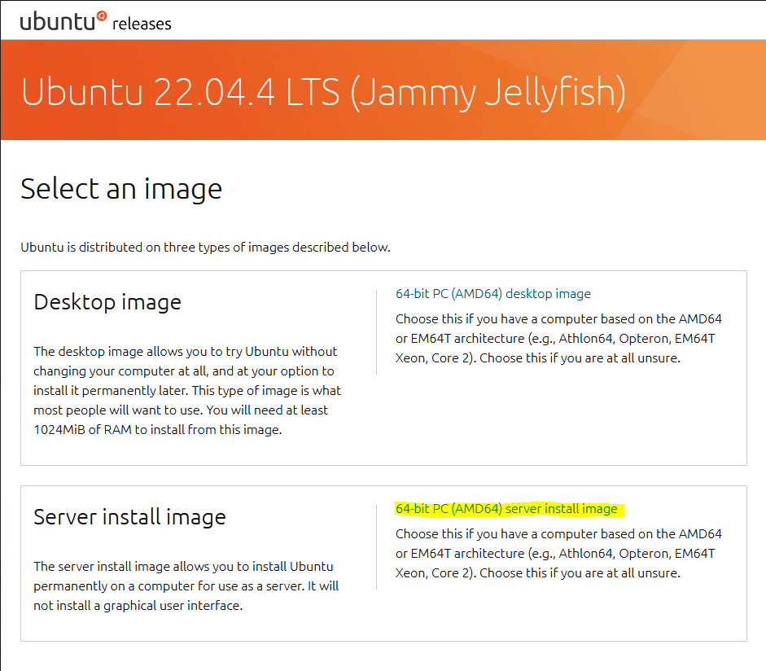
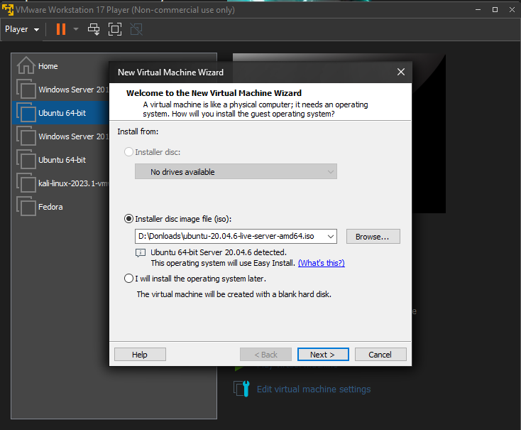
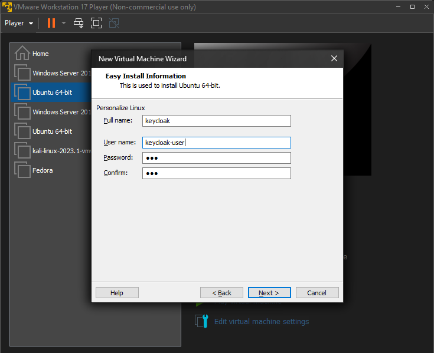
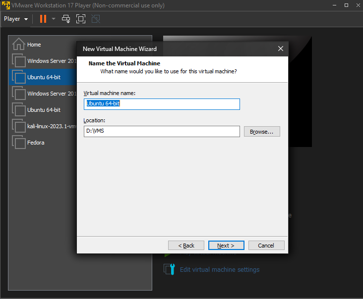
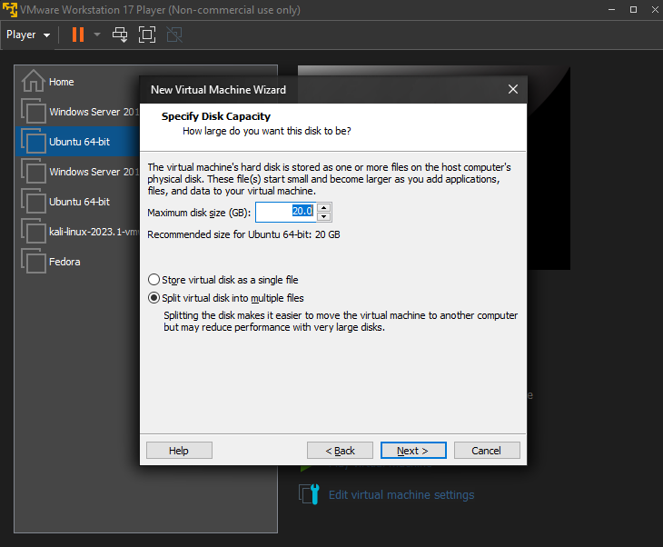
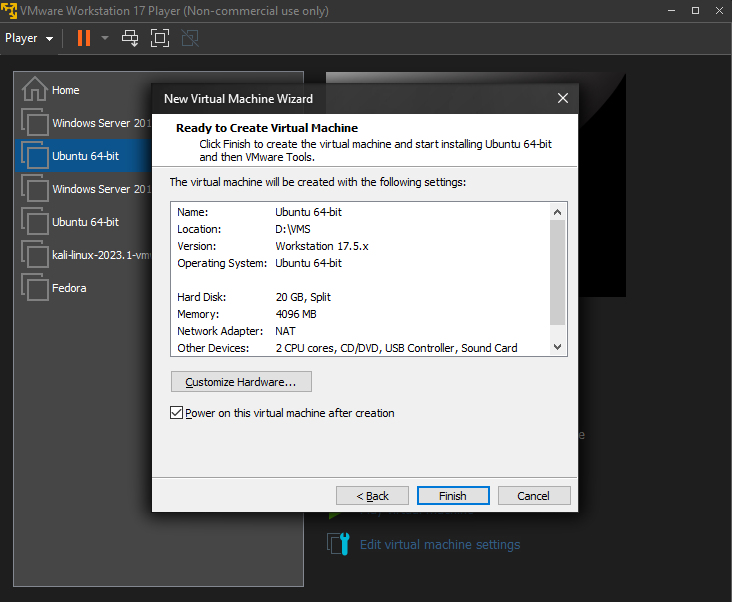

## IAM Project Proof of Concept Setup
*Identity Management POC* will have three virtual machines to simulate the production deployment. One *Keycloak server* as the IAM solution for login management, it will be using *Ubuntu 22.04 Server* . A End-user machine, running the *Cyber-Range* operating system of *Ubuntu 22.04*, with the graphical interface. The end-user machine will be simulating a *Cyber-Range* desktop. For the last Virtual Machine there will be *Windows Server 2019* running *Active Directory Domain Services*  

### **General Overview** 
VM Hypervisor - *VMware*

VM1 (Keycloak) - *Ubuntu 22.04 Server*  

VM2 (End-user) - *Ubuntu 22.04* w/ graphical interface

VM3 (AD Domain Services) - *Windows Server 2019*  w/ graphical interface

## Keycloak Server (VMware Setup)
1. This virtual machine will be using *Ubuntu 22.04* CLI. The ISO can be downloaded from the [Ubuntu website](https://releases.ubuntu.com/jammy/)

   

2. Once installation is complete you can create a new virtual machine on VMware by selecting *Player* and then *New Virtual Machine*

   

3. Choose *Installer dis image file (iso)* and find path of *Ubuntu Server* ISO

   

4. Create username, full name and password

   

5. Name VM to Keycloak-Server, and pick a file location that has room for 20GB

   

6. Make sure its at least 20GB's for the maximum disk size

   

7. Select Finish and boot up the machine

   

## Keycloak Server (Keycloak Setup) 
1. Installing Keycloak server
* Update packages
   ```sh
   sudo apt update 
   ```
*
