## IAM Project Proof of Concept Setup
*Identity Management POC* will have three virtual machines to simulate the production deployment. One *Keycloak server* as the IAM solution for login management, it will be using *Ubuntu 22.04 Server* . A End-user machine, running the *Cyber-Range* operating system of *Ubuntu 22.04*, with the graphical interface. The end-user machine will be simulating a *Cyber-Range* desktop. For the last Virtual Machine there will be *Windows Server 2019* running *Active Directory Domain Services*  

### **General Overview** 
VM Hypervisor - *VMware*

VM1 (Keycloak) - *Ubuntu 22.04 Server*  

VM2 (End-user) - *Ubuntu 22.04* w/ graphical interface

VM3 (AD Domain Services) - *Windows Server 2019*  w/ graphical interface

## Windows Server (VMware Setup) 

## Keycloak Server (VMware Setup)
1. This virtual machine will be using *Ubuntu 22.04* CLI. The ISO can be downloaded from the [Ubuntu website](https://releases.ubuntu.com/jammy/)

   

2. Once installation is complete you can create a new virtual machine on VMware by selecting *Player* and then *New Virtual Machine*

   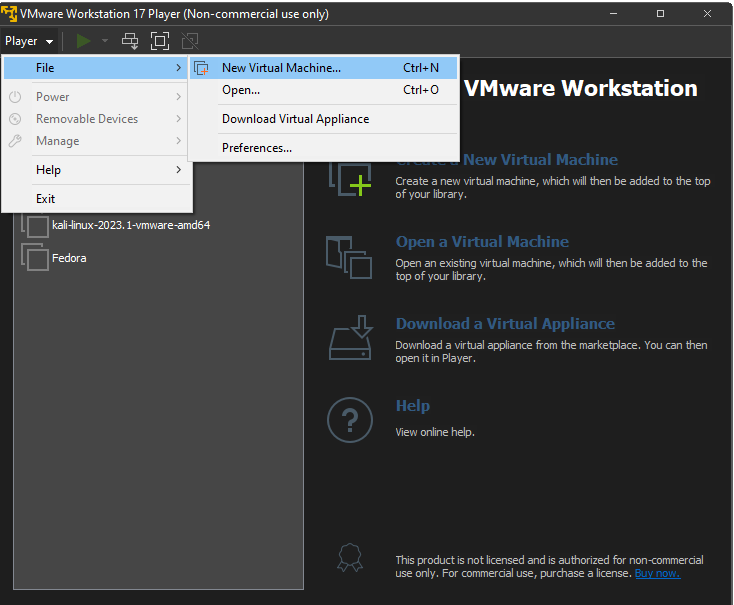

3. Choose *Installer disc image file (iso)* and find path of *Ubuntu Server* ISO

   

4. Create username, full name and password

   

5. Name VM to Keycloak-Server, and pick a file location that has room for 20GB

   

6. Make sure its at least 20GB's for the maximum disk size

   

7. Select Finish and boot up the machine

   

## Keycloak Server (Keycloak Setup) 
Installing Keycloak server
* Update packages
   ```sh
   sudo apt update 
   ```
* Install openJDK 21 
   ```sh
   sudo apt install openjdk-21-jdk
   ```
* Copy raw link (.tar.gz) of the most current version of Keycloak on their [Github Repo](https://github.com/keycloak/keycloak/releases).

    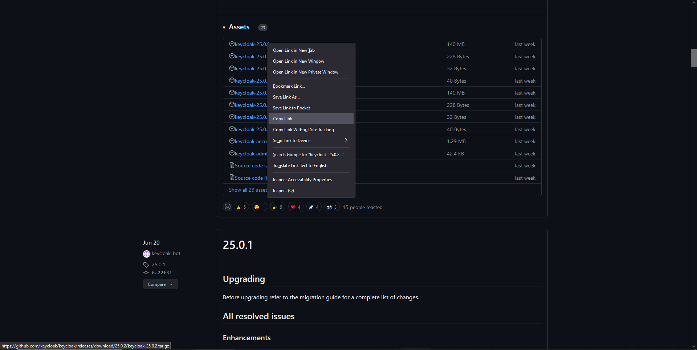

* Do a wget command for the rawlink you copied in order to get the keycloak.tar file
   ```sh
   wget https://github.com/keycloak/keycloak/releases/download/25.0.2/keycloak-25.0.2.tar.gz
   ```
* Using the tar command unzip the file using the flags -xvzf (extracts, lists out, decompresses and gets filenames)
   ```sh
   tar -xvzf keycloak-25.0.2.tar.gz
   ```
* Before you can access the dashboard you will have to setup the admin account by exporting environmental variables
  ```sh
  export KEYCLOAK_ADMIN=<choose a username>
  export KEYCLOAK_ADMIN_PASSWORD=<something secure>
  ```
* Start the server in development mode in the background using the Keycloak shell command and &
  ```sh
  <file-path/bin/kc.sh start-dev &
  ```
* You can access the dashboard using port 8080 and the host machines IP address, http://keycloak-server-ip:8080

## Keycloak Server (Keycloak Configuration)

1. Create a new realm
   * Go to the top left of the Keycloak dashboard and select the dropdown menu, then select *Create realm*

     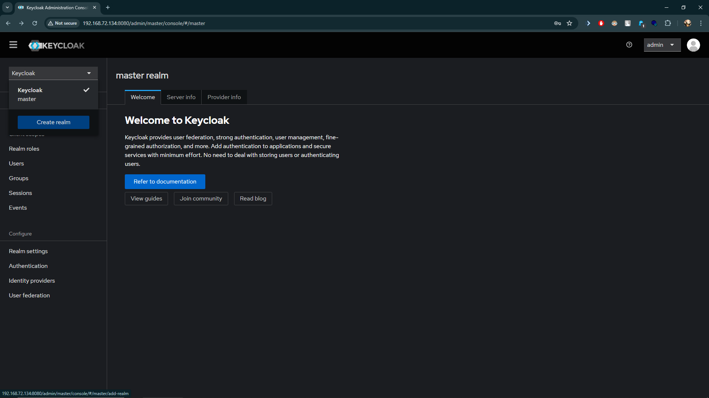
    
   * Create a Realm name and select *Create*

     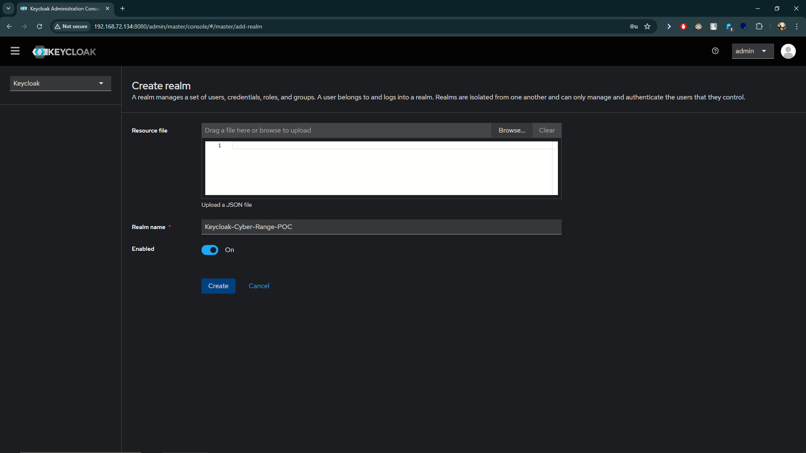
    
2. Create a Client for the End User
   * Select *Create client* 

     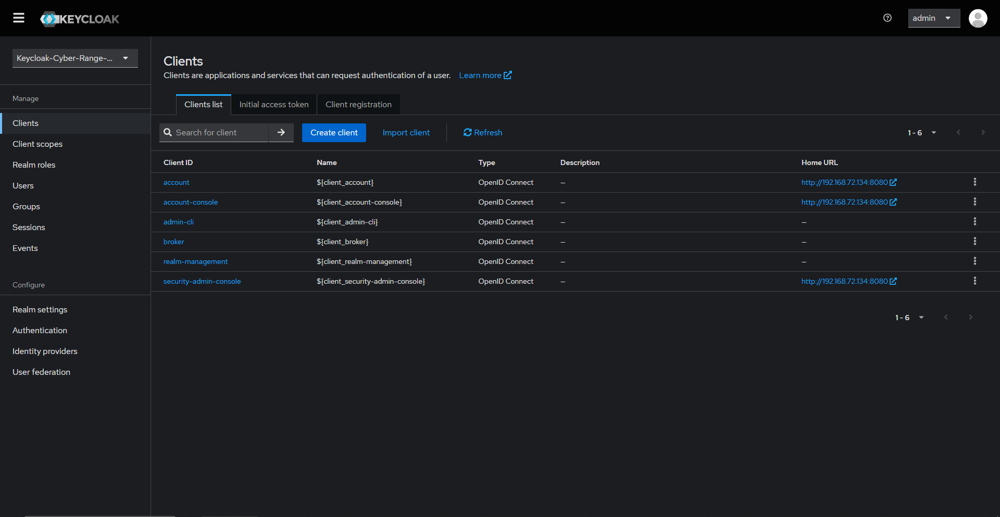
     
   * Make sure client type is set to OpenID Connect, add a Client ID 

     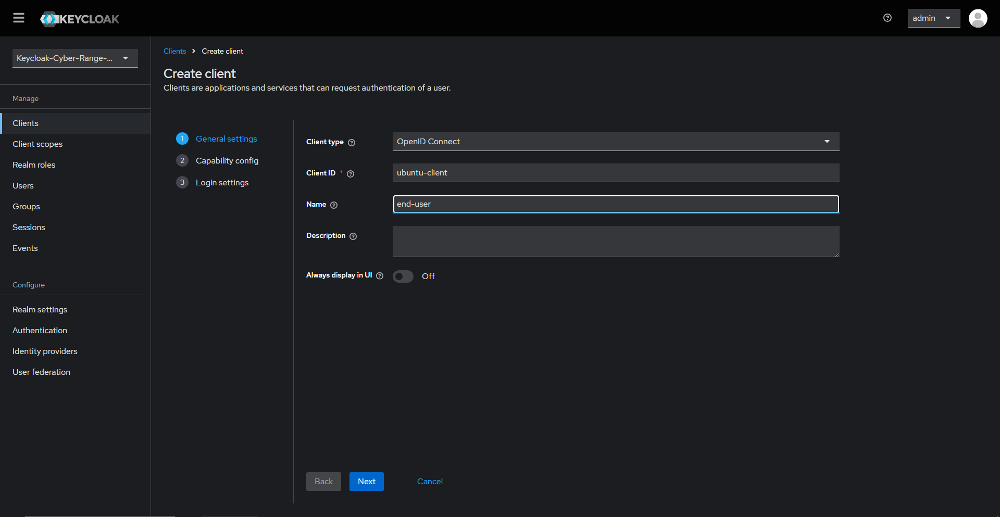
     
   * Set Client authentication to *On* and skip the next page and create the client 

     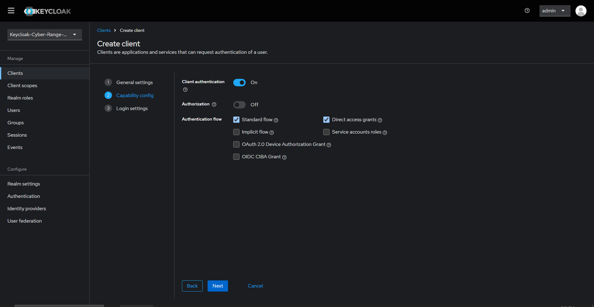
     
   * Go to the Clients page on the left side of the dashboard and credentials and copy the *Client Secret* for later

     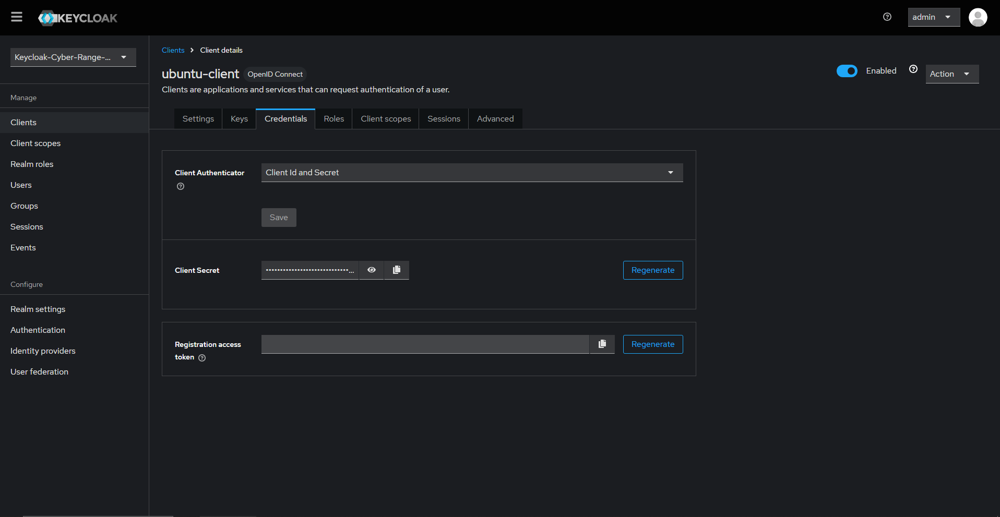
    
3. User Federation using Active Directory 
   * Select *Add new provider*, and choose LDAP

     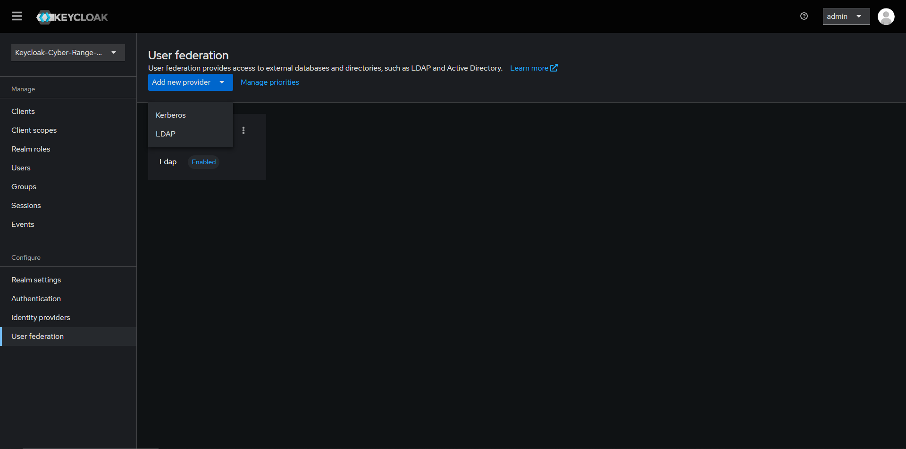
    
   * Use Command prompt on the Windows Server VM as an administrator and send a dsquery command

   ```sh
   dsquery user -name administrator
   ```
   * Choose the Active Directory for the Vendor, replace the Connection URL with the Windows Server IP. For the Bind
     DN you will paste the output of the dsquery command. 

     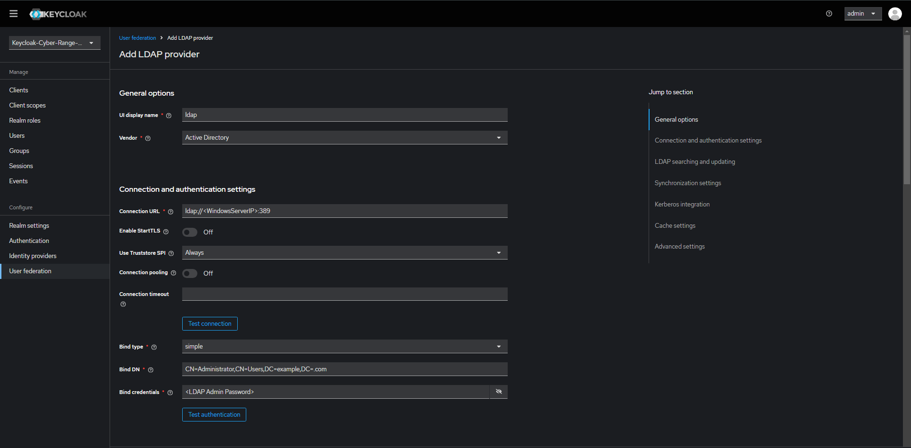

   * Select *WRITABLE* for the Edit mode, for the Users DN you will paste the output from the dsquery but remove the    first argument. The rest of the settings should have autofilled. 
   
      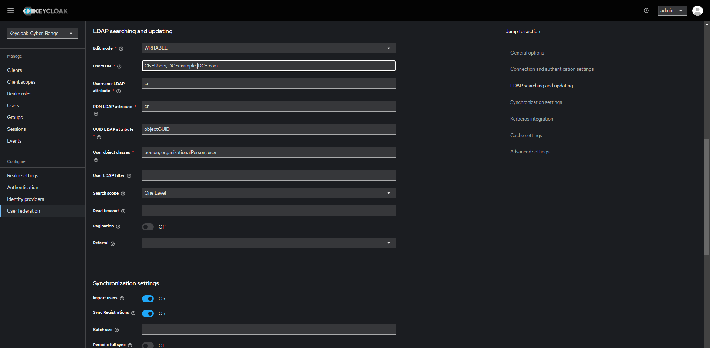

   ## Ubuntu End User (VMware Setup) 
