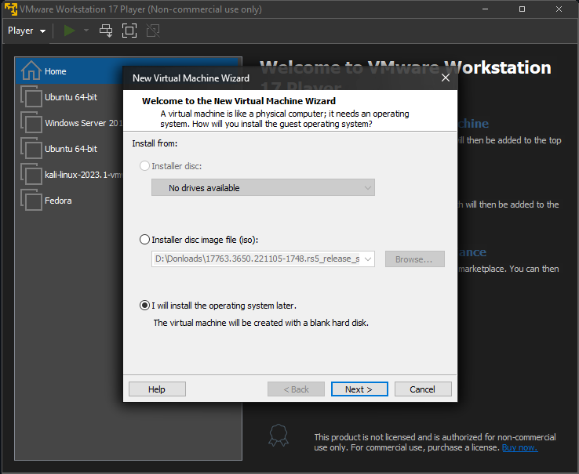
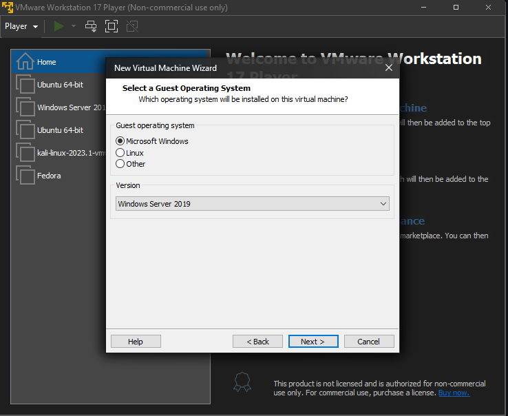
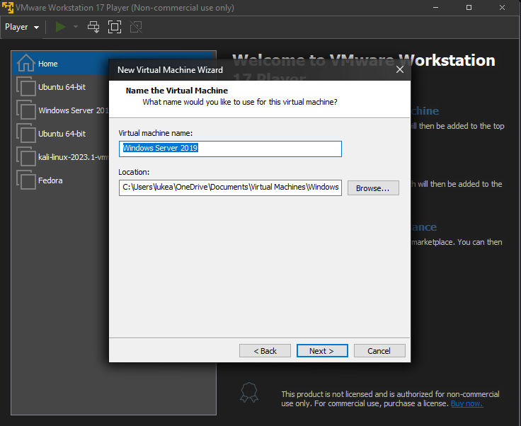
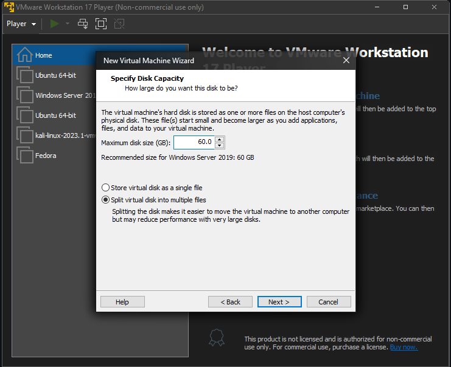
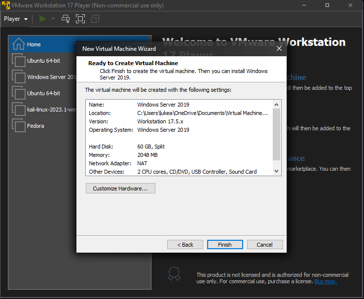
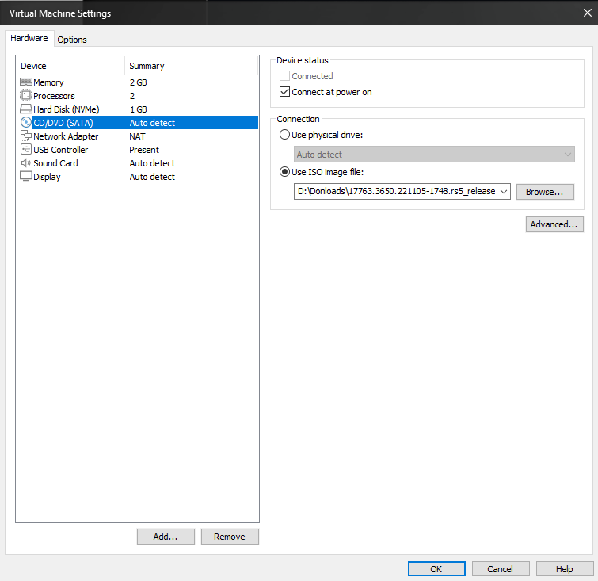
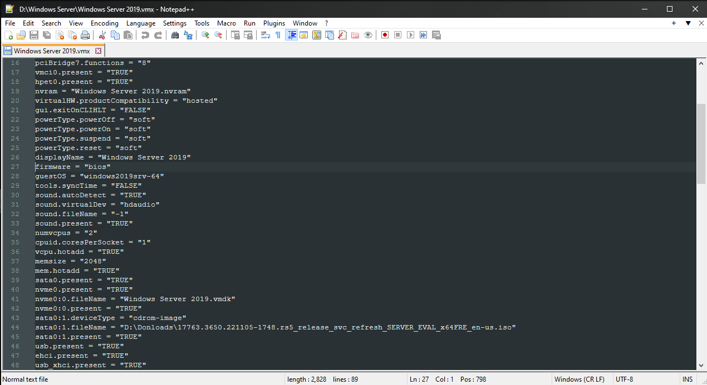
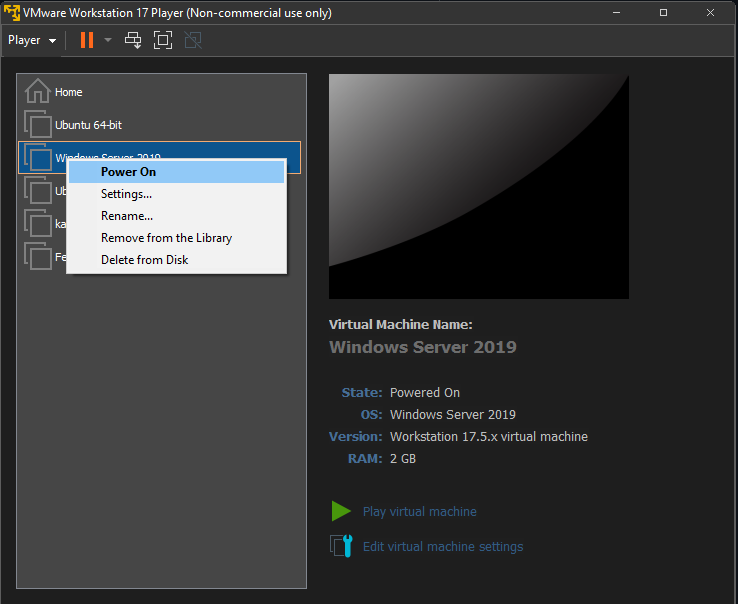

## Windows Active Directory Documentation
In order to use *Active Directory*, we must use *Windows Server*. For this example im using *Windows Server 2019* iso from the [official website](https://www.microsoft.com/en-us/evalcenter/download-windows-server-2019). Youll need a VM application to run this, I chose [VMware](https://www.vmware.com/info/workstation-player/evaluation).

## Creation of Windows VM
**Create Windows VM**
1. Top left to create a new virtual machine
   
   

2. Choose "I will install the OS later"
   
   

3. Click *Next*

   

4. Choose drive/location

   
  
5. At least *60 GB's* needed.

   
  
6. Click *Finish*

   
   
7. Now go to the Windows Server VM settings and change the CD/DVD to use the Windows Server ISO 

   
   
8. Go to the Windows Server VM location and edit the vmx file, change firmware to bios 

   
  
9. Power your Windows Server VM on 

   
  
  
  
